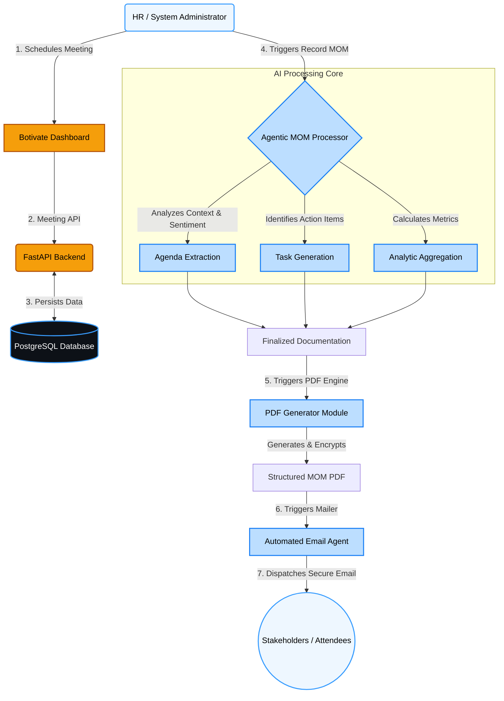

# Botivate: Agentic Minutes of Meeting (MOM) System


Botivate is an intelligent, agentic system designed to autonomously handle, analyze, and document your meeting minutes on autopilot. By leveraging AI capabilities, Botivate transforms unstructured meeting interactions into highly structured, actionable intelligence.

## 🚀 Key Features

- **Agentic Summarization:** The system autonomously drafts MOMs (Minutes of Meeting), identifies key topics, and maps conversations to specific agendas.
- **Intelligent Task Extraction:** Action items are automatically isolated, categorized, and assigned to respective owners without manual intervention.
- **Automated Notifications & Execution:** Botivate automatically sends professional summary emails with dynamically generated, meticulously styled **PDF attachments** directly to stakeholders.
- **Rich Analytics Dashboard:** Gain deep insights into team productivity, meeting frequency trends, attendance rates, and action-item completion metrics.
- **Modern & Premium UI:** Designed with a sleek, minimalist dark/light mode interface characterized by glassmorphism, dynamic animations, and brand-consistent `#399dff` styling.

---

## 🧠 System Architecture & Workflow

Below is the high-level workflow of the Botivate Agentic MOM System, outlining how raw data translates into automated task resolution.



---

## 🛠 Tech Stack

### Frontend
- **React 18** + **Vite**
- **TypeScript**
- **Tailwind CSS v3** (Custom Brand System)
- **Recharts** for Analytics
- **Heroicons** for SVG Iconography
- **Zustand** for State Management
- **React Query** for Data Fetching & Caching

### Backend
- **Python 3.10+**
- **FastAPI** (High-performance API framework)
- **SQLAlchemy ORM** + **PostgreSQL**
- **ReportLab** for dynamic, aesthetic PDF Generation
- **FastAPI-Mail** for asynchronous Email Delivery

---

## 📂 Project Structure

```text
📦 MOM_AI_Assistant
 ┣ 📂 backend
 ┃ ┣ 📂 app
 ┃ ┃ ┣ 📂 api               # FastAPI route endpoints
 ┃ ┃ ┣ 📂 models            # SQLAlchemy database schemas
 ┃ ┃ ┣ 📂 schemas           # Pydantic validation schemas
 ┃ ┃ ┣ 📂 services          # Core business logic & Agentic services
 ┃ ┃ ┣ 📂 notifications     # Email server & PDF Generation logic
 ┃ ┃ ┣ 📜 main.py           # Application entrypoint
 ┃ ┃ ┗ 📜 database.py       # DB Connection pooling
 ┃ ┣ 📜 requirements.txt    # Python dependencies
 ┃ ┗ 📜 .env                # Environment variables
 ┣ 📂 frontend
 ┃ ┣ 📂 src
 ┃ ┃ ┣ 📂 components        # Reusable UI components (Stats, Drawers, Layout)
 ┃ ┃ ┣ 📂 pages             # Application views (Dashboard, Meetings, Detail)
 ┃ ┃ ┣ 📂 store             # Zustand global state (Theme)
 ┃ ┃ ┣ 📜 App.tsx           # Router configuration
 ┃ ┃ ┗ 📜 index.css         # Global Tailwind directives & Brand tokens
 ┃ ┣ 📜 tailwind.config.js  # Deep-customized brand theme
 ┃ ┣ 📜 vite.config.ts      # Vite bundler config
 ┃ ┗ 📜 package.json        # Node dependencies
 ┣ 📜 README.md             # Project Overview
 ┗ 📜 SETUP.md              # Installation & Deployment instructions
```

---

## ℹ️ Setup & Installation

Please refer to the [SETUP.md](SETUP.md) file for comprehensive, step-by-step instructions on running Botivate locally and deploying it to production servers.

---
*Botivate Services LLP © 2026. Powering Businesses On Autopilot.*